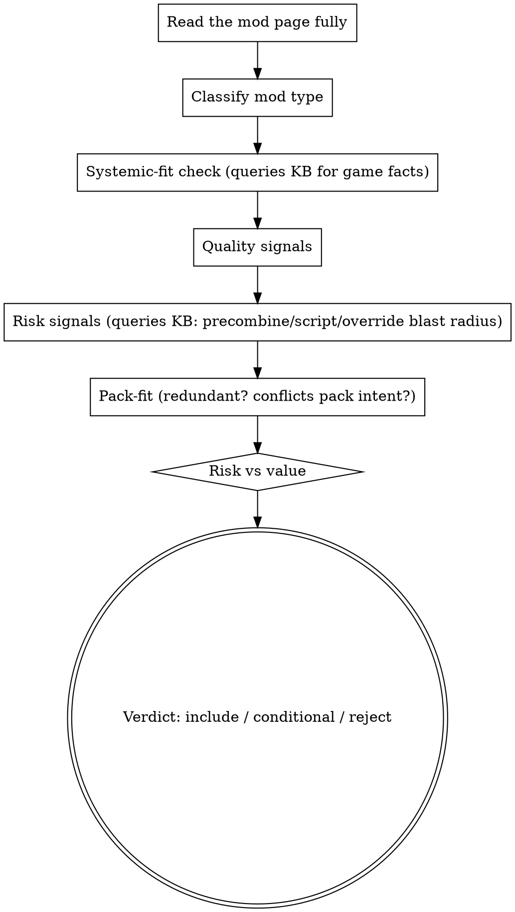

# evaluating-bgs-mods Implementation Plan

> **For agentic workers:** REQUIRED SUB-SKILL: Use superpowers:subagent-driven-development (recommended) or superpowers:executing-plans to implement this plan task-by-task. Steps use checkbox (`- [ ]`) syntax for tracking.

**Goal:** Ship the first 思想论 judgment skill — `evaluating-bgs-mods` — that encodes the curator's real "should this mod go in the pack?" decision logic, game-agnostic in the skill body with game-specific facts in the KB.

**Architecture:** A standalone gerund-named skill at `skills/evaluating-bgs-mods/SKILL.md` following the superpowers SKILL.md anatomy (Iron Law + flowchart + red-flags + rationalizations + route gate + terminal handoff). Judgment FRAMEWORK lives in the skill; game-specific FACTS live in `bgs-kb` (reusing the existing `install-planning`/`engine` domains, scoped per game). Skill always `bgs_kb_query`s, never inlines game facts. Registered in the bootstrap router (3 places). Content is grounded in the curator's tutorial corpus (`.opencode/artifacts/sixiang-sources/`), not invented.

**Tech Stack:** Markdown SKILL.md; `bgs-kb` records (markdown+YAML frontmatter, schema v1); `scripts/dev-kb-author.ps1` (validate→build→materialize); `scripts/build-portable-plugin.ps1`; git.

**Branch:** `feat/sixiang-evaluating-bgs-mods` in the main checkout (project convention — NO worktree per repo AGENTS.md).

**Spec:** `docs/internal/plans/2026-06-23-sixiang-judgment-layer-architecture.md`.

---

## File Structure

- Create: `skills/evaluating-bgs-mods/SKILL.md` — the judgment skill (game-agnostic framework only).
- Create: `knowledge/bgs-kb/packs/core/records/mod-evaluation/systemic-design-fit.v1.md` — cross-game "what makes a mod fit" anchor.
- Create: `knowledge/bgs-kb/packs/core/records/mod-evaluation/quality-and-risk-signals.v1.md` — cross-game quality/risk signal taxonomy.
- Create: `knowledge/bgs-kb/packs/bgs-kb-fallout4/records/fo4-previs/precombine-breaking-mod-patterns.v1.md` — FO4-specific evaluation fact (if not already present; else extend).
- Modify: `skills/using-bgs-modding-superpowers/SKILL.md` — register in 3 places (router table, How-to-use, See also).
- Modify: `docs/internal/roadmap.md` — flip "mod evaluator: Scaffolded only" → shipped judgment skill.
- Intermediate artifact (not committed): `.opencode/artifacts/sixiang-build/evaluating-bgs-mods/framework-extraction.md`.
- Materialized (commit 2): `plugins/bgs-modding-superpowers/skills/evaluating-bgs-mods/...` + `plugins/.../knowledge/bgs-kb/...` (produced by build script, do not hand-edit).

---

## Task 0: Feature branch

- [ ] **Step 1: Create and switch to the feature branch**

Run:
```bash
git checkout -b feat/sixiang-evaluating-bgs-mods
```
Expected: `Switched to a new branch 'feat/sixiang-evaluating-bgs-mods'`.

---

## Task 1: Mine the source corpus → framework extraction (grounding)

**Files:**
- Read: `.opencode/artifacts/sixiang-sources/articles/cv21859652.txt`, `.../opus_813053196219973664.txt`
- Read (GBK source, decode with GB18030): `F:\my clip\Bethesda Breakdown\Bethesda_设计理念报告_视频稿完整版_BB84风格.txt`, `F:\my clip\FO4\MOD Tutorial\E12\Fallout 4 Mod整合搭建教程.txt`
- Create: `.opencode/artifacts/sixiang-build/evaluating-bgs-mods/framework-extraction.md`

- [ ] **Step 1: Make UTF-8 working copies of the two GBK source scripts**

Run:
```powershell
$dst='D:\awesome-bgs-mod-master\.opencode\artifacts\sixiang-build\evaluating-bgs-mods'
New-Item -ItemType Directory -Force -Path $dst | Out-Null
foreach($p in @(
  @{src='F:\my clip\Bethesda Breakdown\Bethesda_设计理念报告_视频稿完整版_BB84风格.txt'; out='src-bb84-design-philosophy.txt'},
  @{src='F:\my clip\FO4\MOD Tutorial\E12\Fallout 4 Mod整合搭建教程.txt'; out='src-e12-modpack-guide.txt'}
)){
  $b=[IO.File]::ReadAllBytes($p.src)
  try{ $t=[Text.UTF8Encoding]::new($false,$true).GetString($b) } catch { $t=[Text.Encoding]::GetEncoding('GB18030').GetString($b) }
  Set-Content -LiteralPath (Join-Path $dst $p.out) -Value $t -Encoding UTF8
}
```
Expected: two `src-*.txt` files created under the build artifact dir.

- [ ] **Step 2: Read all four sources and extract the judgment framework**

Read the two `src-*.txt` UTF-8 copies + the two article `.txt` files. Produce `framework-extraction.md` with EXACTLY these sections (this is the contract the SKILL.md is built from):
1. **What "good mod for THIS pack" means** — the curator's systemic-design-fit framing (systems-simulation, emergent gameplay, player agency, exploration), in his own emphasis.
2. **Quality signals** — concrete signals the curator actually uses (author track record, update cadence, bug-report responsiveness, requirements clarity, documentation, etc.).
3. **Risk signals** — what makes a mod risky (wide overrides, precombine/previs touch, script-heaviness, leveled-list/NPC overhauls, save-baking).
4. **Pack-fit signals** — redundancy with existing mods, conflict with pack intent, dependency weight.
5. **Red flags (thought→reality)** — at least 4, drawn from the source.
6. **Rationalizations (excuse→reality)** — at least 4, drawn from the source.
7. **Game-specific facts to route to KB** — tag each as FO4 / Skyrim / Starfield / cross-game; these become KB records, NOT skill content.

Each extracted point MUST cite the source file it came from. Do NOT invent generic mod-evaluation advice; if the source is silent on a point, mark it `[GAP — needs user input]`.

- [ ] **Step 3: REVIEW GATE — orchestrator verifies extraction fidelity**

The orchestrator reads `framework-extraction.md` against the sources and confirms: (a) every point is source-cited, (b) no invented generic advice, (c) game-specific facts are correctly separated out. Fix or re-mine before proceeding. (Under subagent-driven-development, this is the between-task review.)

---

## Task 2: Write the skill SKILL.md (game-agnostic framework)

**Files:**
- Create: `skills/evaluating-bgs-mods/SKILL.md`

- [ ] **Step 1: Write the complete SKILL.md**

Populate the judgment specifics (Iron Law wording, red-flags rows, rationalizations rows, flowchart decision nodes) from Task 1's reviewed extraction. The structure below is the required anatomy; the candidate content shown is the grounded starting point — refine wording to match the extraction, but keep every section.

````markdown
---
name: evaluating-bgs-mods
description: Use when deciding whether a mod belongs in a modpack — judging mod quality, fit, risk, and pack-value BEFORE download/install. Triggers - "should I add this mod", "is this mod good", "评估这个mod", "这个mod值得装吗", "is this mod worth it", "this mod looks too good to be true", "compare these mods", "does this mod fit my pack". NOT for how to install a mod (use interpreting-mod-author-instructions), load order (writing-bgs-load-order), or conflict resolution (xedit-conflict-audit).
---

# Evaluating BGS Mods (judgment skill)

## The Iron Law

A mod earns a place in the pack ONLY by fitting the pack's intent AND preserving the game's systemic coherence. Popularity, screenshots, and endorsement counts are inputs — never proof of fit.

## Route gate (one primary skill per intent)

- USE me when: the question is "should this mod go in the pack / is it good / which of these is better".
- DO NOT use me for: how to install it -> `interpreting-mod-author-instructions`; where it loads -> `writing-bgs-load-order`; record conflicts -> `xedit-conflict-audit`.
- After a verdict of INCLUDE, hand off to `interpreting-mod-author-instructions`.

## When to use / When NOT

[from extraction §1; bilingual + symptom triggers already in frontmatter]

## Process Flow



## KB query discipline

For every evaluation, query game-specific facts — never inline them here:
```
bgs_kb_query({ query: "<mod type> risk signals", domains: ["install-planning","engine"], games: ["<current game>"] })
```
If you are about to write a game-specific fact into THIS file, STOP — it belongs in a KB `mod-evaluation` record.

## Checklist
[numbered, from extraction §2-4]

## Red Flags (STOP)
| Thought | Reality |
|---|---|
| "100k endorsements, must be good" | popularity != fit; many popular mods break systemic coherence or conflict with the pack. |
| "the screenshots look amazing" | visuals are not systemic value; a pretty mod that nukes precombines costs more than it gives. |
| "it's small, low risk" | small mods can touch precombined cells or core leveled lists with outsized blast radius. |
| [+ extraction §5 rows] | |

## Rationalizations
| Excuse | Reality |
|---|---|
| "I'll just add it and see" | unverified additions blow rollback boundaries; evaluate before download. |
| "the author says it's compatible with everything" | author claims are inputs; verify against YOUR pack. |
| "everyone uses it" | your pack's intent is the standard, not the crowd's. |
| [+ extraction §6 rows] | |

## See also
- `interpreting-mod-author-instructions` — terminal handoff after INCLUDE.
- `curating-bgs-modpack` — pack-level intent this skill judges against.
- KB: `bgs_kb_query` domain `install-planning` / `engine`, scoped per game.
````

- [ ] **Step 2: Verify anatomy completeness + no inlined game facts**

Run:
```powershell
$f='D:\awesome-bgs-mod-master\skills\evaluating-bgs-mods\SKILL.md'
foreach($h in '## The Iron Law','## Route gate','## Process Flow','## KB query discipline','## Red Flags','## Rationalizations','## See also'){ if(-not (Select-String -LiteralPath $f -SimpleMatch $h)){ "MISSING: $h" } }
Select-String -LiteralPath $f -Pattern 'precombine|Buffout|Nemesis|DynDOLOD|SFSE|\.NET Script' | ForEach-Object { "POSSIBLE INLINED GAME FACT: line $($_.LineNumber): $($_.Line.Trim())" }
```
Expected: no `MISSING:` lines; no `POSSIBLE INLINED GAME FACT` lines (game facts belong in KB). Fix any hit.

---

## Task 3: Author the cross-game KB records

**Files:**
- Create: `knowledge/bgs-kb/packs/core/records/mod-evaluation/systemic-design-fit.v1.md`
- Create: `knowledge/bgs-kb/packs/core/records/mod-evaluation/quality-and-risk-signals.v1.md`

- [ ] **Step 1: Create the mod-evaluation folder + systemic-fit record**

Create `knowledge/bgs-kb/packs/core/records/mod-evaluation/systemic-design-fit.v1.md` (fill body from extraction §1):
```markdown
---
id: mod-evaluation.systemic-design-fit.v1
title: A good modpack mod respects the game's systemic-simulation design
domains: [install-planning, engine]
appliesTo:
  games: [SkyrimLE, SkyrimSE, SkyrimAE, SkyrimVR, Fallout4, Fallout4VR, Fallout3, FalloutNV, Starfield]
  engineFamilies: [gamebryo, creation-engine, creation-engine-2]
canonical:
  answer: Judge a mod by whether it preserves the game's emergent systems and player agency, not by popularity or visuals; a mod that breaks systemic coherence is a poor pack fit even when polished.
  confidence: high
queryKeys: [mod evaluation, systemic design, pack fit, is this mod good, mod quality]
severity: medium
sources:
  - kind: tutorial
    ref: BB84 modpack tutorials (design-philosophy + E12 整合搭建)
related: [mod-evaluation.quality-and-risk-signals.v1]
lastReviewed: "2026-06-23"
schemaVersion: 1
---

# A good modpack mod respects the game's systemic-simulation design

[body from extraction §1, cross-game framing, no game-specific mechanics]
```

- [ ] **Step 2: Create the quality-and-risk-signals record**

Create `knowledge/bgs-kb/packs/core/records/mod-evaluation/quality-and-risk-signals.v1.md` with the same frontmatter shape (`id: mod-evaluation.quality-and-risk-signals.v1`, domains `[install-planning]`, all games), body from extraction §2-4 (quality/risk/pack-fit signal taxonomy, cross-game).

- [ ] **Step 3: Author/extend the FO4 precombine evaluation fact**

If `knowledge/bgs-kb/packs/bgs-kb-fallout4/records/fo4-previs/` lacks a "precombine-breaking mod patterns" record, create `precombine-breaking-mod-patterns.v1.md` (id `fo4-previs.precombine-breaking-mod-patterns.v1`, domains `[engine, archive-precedence, install-planning]`, `appliesTo.games: [Fallout4, Fallout4VR]`), body from extraction §7 FO4 items. If one exists, only add `queryKeys` so `mod evaluation` retrieval reaches it. (Skyrim/Starfield equivalents are deferred to their own sequencing slots.)

---

## Task 4: Validate + build + materialize KB

- [ ] **Step 1: Run the dev KB author cycle for the edited packs**

Run:
```powershell
pwsh scripts\dev-kb-author.ps1 -PackId core
pwsh scripts\dev-kb-author.ps1 -PackId bgs-kb-fallout4
```
Expected: validate PASS, build PASS, materialize PASS for each. If validation fails, fix frontmatter against `knowledge/bgs-kb/schema/record.schema.json` and re-run.

---

## Task 5: Register the skill in the bootstrap router (3 places)

**Files:**
- Modify: `skills/using-bgs-modding-superpowers/SKILL.md`

- [ ] **Step 1: Add the router-table row**

In the `## Available skills` table, add (after the `setting-up`/`maintaining` rows, before `xedit-automation`, to keep curation flow grouped):
```markdown
| `evaluating-bgs-mods` | Deciding whether a mod belongs in the pack; "should I add this mod", "is this mod good", "评估这个mod", "这个mod值得装吗", "this mod looks too good to be true" |
```

- [ ] **Step 2: Add a How-to-use bullet**

In `## How to use this bootstrap`, add:
```markdown
- When the user is deciding whether to add/keep a mod ("should I install X", "is this good", "评估"), route to `evaluating-bgs-mods` before any install action.
```

- [ ] **Step 3: Add a See-also entry**

In `## See also`, add:
```markdown
- `evaluating-bgs-mods` — judgment skill: should this mod go in the pack (BGS systemic-design fit, quality/risk/pack-value).
```

---

## Task 6: Build portable plugin, restart, verify retrieval + semantic acceptance

- [ ] **Step 1: Materialize the plugin tree**

Run:
```powershell
pwsh scripts\build-portable-plugin.ps1 -OutputDir plugins -PluginName bgs-modding-superpowers -McpPathStrategy relative -Force
```
Expected: `plugins/bgs-modding-superpowers/skills/evaluating-bgs-mods/SKILL.md` and the materialized `knowledge/bgs-kb/...` exist.

- [ ] **Step 2: Restart OpenCode (MCP discovery is one-shot) and verify KB retrieval**

After restart, run:
```
bgs_kb_query({ query: "is this mod good systemic design fit", domains: ["install-planning"], games: ["Fallout4"] })
```
Expected: returns `mod-evaluation.systemic-design-fit.v1` (and the quality/risk record) in the top hits.

- [ ] **Step 3: Semantic acceptance — routing + fidelity**

1. Routing: confirm a representative phrase ("should I add this settlement mod?", "评估这个mod") routes to `evaluating-bgs-mods` (not to a tool skill).
2. Fidelity: diff the SKILL.md judgment content against `framework-extraction.md` — every red-flag/rationalization traces to a source-cited extraction point; no invented generic advice; no inlined game facts (Task 2 Step 2 guard stays green).
Record the acceptance result under `.opencode/artifacts/sixiang-build/evaluating-bgs-mods/acceptance.md`.

---

## Task 7: Commit (two-commit shape) + roadmap update

- [ ] **Step 1: Update the roadmap Capability Map**

In `docs/internal/roadmap.md`, change the `mod evaluator` row from "Scaffolded only" to shipped, pointing at `skills/evaluating-bgs-mods/` + the spec + this plan.

- [ ] **Step 2: Commit source**

Run:
```bash
git add skills/evaluating-bgs-mods/SKILL.md knowledge/bgs-kb/packs/core/records/mod-evaluation knowledge/bgs-kb/packs/core/kb.sqlite knowledge/bgs-kb/packs/core/manifest.json knowledge/bgs-kb/packs/bgs-kb-fallout4 skills/using-bgs-modding-superpowers/SKILL.md docs/internal/roadmap.md
git commit -m "feat(skill): evaluating-bgs-mods judgment skill + mod-evaluation KB records"
```

- [ ] **Step 3: Commit materialized plugin tree**

Run:
```bash
git add plugins/bgs-modding-superpowers
git commit -m "chore(materialize): evaluating-bgs-mods + KB into portable plugin tree"
git log --oneline -3
```
Expected: two new commits; vendor-pull sync (per repo AGENTS.md dev cycle) deferred to batch close.

---

## Self-Review

- **Spec coverage:** This plan implements spec §4 row 1 (`evaluating-bgs-mods`), spec §6 (KB reuse of `install-planning`/`engine`, FO4 precombine → KB), spec §7 conventions (anatomy, KB-query discipline, bilingual+symptom triggers, boundary-drift guard, route gate), spec §8 registration (3 places), spec §11 acceptance (route + fidelity + no-inlined-facts). Other spec rows are separate plans (sequencing §10).
- **Placeholder scan:** Source-derived judgment content is intentionally produced in Task 1 and reviewed before Task 2 (a mining task, not a placeholder); all structural content, paths, commands, and frontmatter are complete. `[GAP — needs user input]` markers in the extraction are surfaced to the user, not silently filled.
- **Type/name consistency:** skill id `evaluating-bgs-mods` and KB ids `mod-evaluation.systemic-design-fit.v1` / `mod-evaluation.quality-and-risk-signals.v1` used consistently across tasks; terminal handoff target `interpreting-mod-author-instructions` matches the spec.
